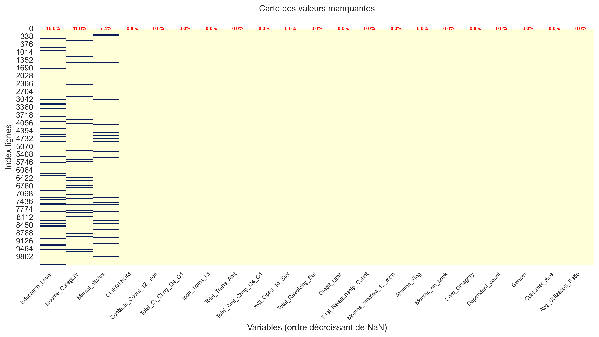
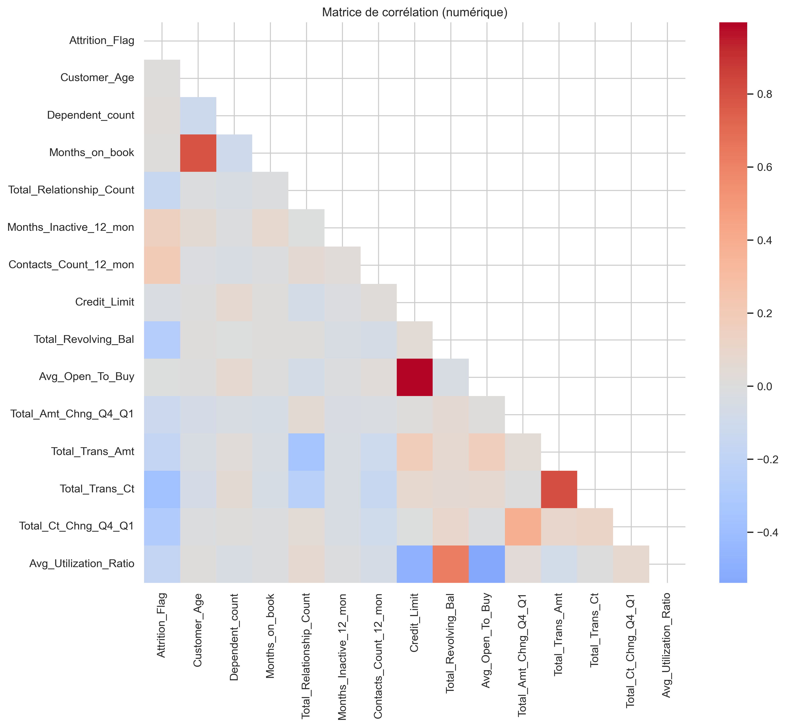
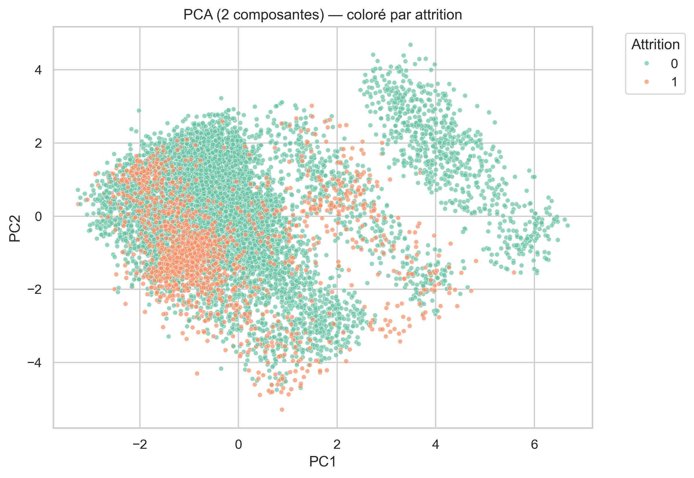
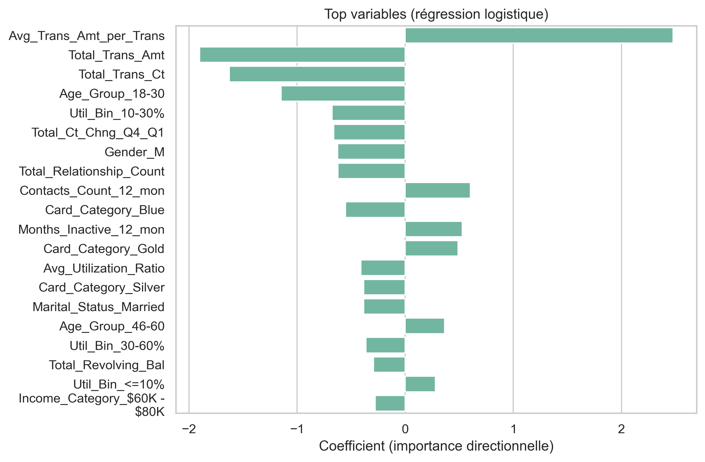

# 📊 Analyse exploratoire complète du churn bancaire (BankChurners)

## 🎯 Objectif
Analyser les facteurs liés à l’attrition des clients bancaires à partir du jeu de données *BankChurners*, afin d’identifier des leviers concrets de rétention.  
L’étude combine un nettoyage rigoureux des données, des visualisations claires et une modélisation explicable.

---

## 📂 Jeu de données
- **Source** : BankChurners (données fictives publiques)
- **Taille** : 10 127 lignes, 23 variables
- **Contenu** : informations démographiques, comportements transactionnels, produits détenus

---

## 🛠 Méthodologie
1. **Préparation & nettoyage**
   - Suppression de variables à risque de fuite (*leakage*)
   - Gestion des valeurs manquantes et codes “Unknown”
   - Typage des variables
2. **Analyse exploratoire des données (EDA)**
   - Analyse univariée, bivariée et multivariée
   - Tests statistiques (Mann–Whitney, Chi²)
   - Détection des valeurs aberrantes (IQR)
3. **Feature engineering**
   - Création de variables dérivées (ex. montant moyen par transaction, tranches d’âge)
4. **Modélisation explicable**
   - Régression logistique
   - ROC‑AUC, matrice de confusion, importances directionnelles
5. **Segmentation**
   - PCA, t‑SNE, KMeans

---

## 📊 Aperçu visuel

| Valeurs manquantes | Corrélations | Performance modèle |
|--------------------|--------------|--------------------|
|  |  |  |

| Distribution clé | Segmentation PCA | Importances |
|------------------|------------------|-------------|
|  |  |  |

---

## 📈 Résultats clés
- **Facteurs majeurs** : activité transactionnelle, variations trimestrielles, inactivité récente
- Influence de certaines catégories de carte et tranches de revenus
- Modèle interprétable capable de classer les clients à risque

---

## 💡 Recommandations
- Campagnes de rétention ciblées sur les profils à forte probabilité de churn
- Alertes précoces sur inactivité prolongée
- Segmentation des offres selon profil client

---

## 🚀 Utilisation
1. **Cloner le dépôt**
   ```bash
   git clone https://github.com/Nouhe99/EDA_churn_bancaire.git
   cd EDA_churn_bancaire
2. **Installer les dépendances**
   ```bash
   pip install -r requirements.txt
3. **Lancer le notebook**
   ```bash
   jupyter notebook
4. **Ouvrir** "EDA_churners_banque.ipynb" **et exécuter les cellules**

---

## 🧰 Stack technique

   Python 3.x
   
   pandas, numpy, matplotlib, seaborn

   scikit‑learn, scipy

   Jupyter Notebook
   
